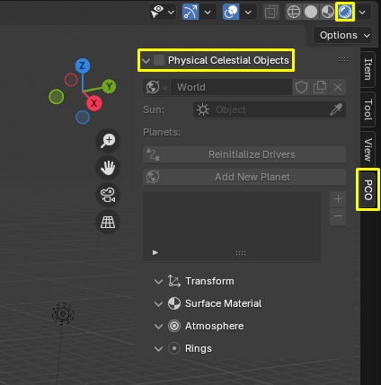

# Getting started

_Physical Celestial Objects_ (PCO) is a Blender addon for <MĀRTINŠ>.

## Requirements
Latest _Physical Celestial Objects_ version is supported by [Blender 3.3+](https://www.blender.org/).

## Installation

!!! info
    "Physical Celestial Objects" is only available for purchase on
    [Blender Market](https://blendermarket.com/products/physical-celestial-objects) or [Gumroad](https://martinsh.gumroad.com/l/physical-celestial-objects).
    Get your latest version there.

- Download the "physical-celestial-objects-[version here].zip" file.
- Open Blender.
- Go to Edit/Preferences. 
- Choose "Add-ons" tab and press "Install..." button. 
- Locate the .zip file and press "Install Add-on".
- You will see the newly installed add-on, enable it by checking the checkbox. 
- Wait till it registers. Voila!

## First Run
- Locate _Physical Celestial Objects_ panel in the [Sidebar](https://docs.blender.org/manual/en/latest/interface/window_system/regions.html#sidebar)
also called _N Panel_ . Click on the tab _PCO_ to reveal it.
- Enable addon by ticking the uppermost checkbox.

!!! important
    To see the sky, you have to be in "Rendered" Viewport Shading mode.

!!! info
    When adding the planet, it will first appear in the scene origin and will seem small. You can add realistic sizes, distances in the transform options eg. moon size/distance.

- Disable the addon by ticking the uppermost checkbox.

!!! summary "What happens when the atmosphere is added?"
    - <MĀRTINŠ>.

## Preferences
There is no one _right way_ way to use this addon. That is why we encourage you to find the way
it works best for you. 

The addon [preferences panel](img/UI/UI_preferences.jpg) is located under
`Edit > Preferences > Add-ons`.

### Toolbar Enabled
:octicons-milestone-24: _Default_: `true`

By default, the _Physical Celestial Objects_ tab is in the sidebar of Blender 3D viewport (`N` key) and "World Properties" tab in
Properties panel. Setting this to `false` will hide the toolbar. Reveal panel by clicking on _PCO_ tab. 

## Presets
Presets store a snapshot of a predefined celestial object.

<add preset picture>

The addon comes with 3 different presets.

- `Earth`
- `Mars`
- `Saturn`

### Using presets

1. Install the PSA addon (version 1.8+).
2. Enable the addon inside the *Blender Preferences*.
3. Add the *Atmosphere* inside the *Blender Viewport*, which will make the presets visible inside Blender.
4. In the n panel under ''presets'' pick a preset of your liking.
5. You should now see the preset in your scene!

??? summary "Troubleshooting: Concerning previous versions of Presets"     
    If you have used the previous versions of Presets (using the asset browser) this is how you can migrate them to the new system:
                
      - Navigate to Blender asset libraries
      - There you have to find the User Library ''PSA'' or the library's name that corresponds to your presets
      - drag the asset in to your scene
      - create a new preset through the n panel, name and save it
      - you now have your preset migrated!
        

### How to make your own presets

1. In the PSA panel click `+ new preset`.
2. Name it something memorable, avoid special characters.
3. Modify the PSA parameters to your liking.
4. Save the changes you made!

!!! tip 
     Use ''Use preset sun location'' if you want to save the suns location in the preset. If you dont want the preset to change your suns location then leave the box unchecked.