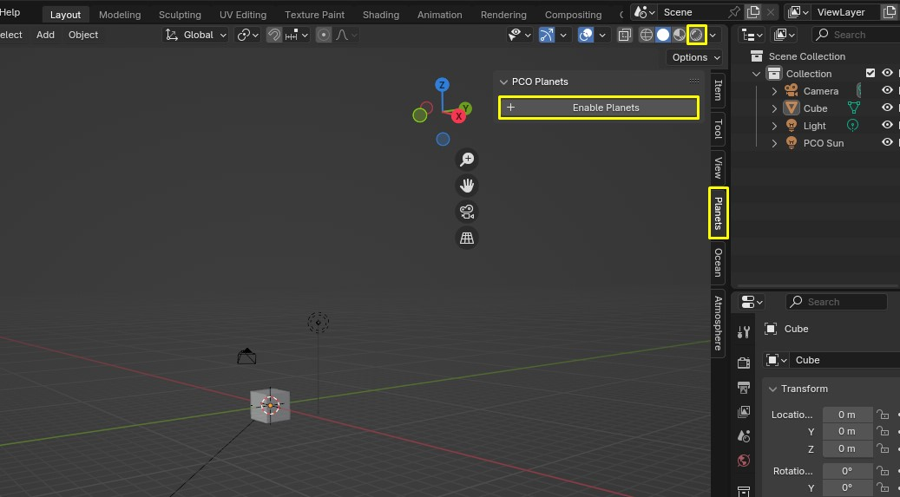

# Getting started

_Physical Celestial Objects_ (PCO) is a Blender add-on that lets you create realistic, real-scale planets with ease. Compatible with Eevee and Cycles, it enables quick and accurate celestial object creation for visually stunning space scenes.

## Requirements
Latest _Physical Celestial Objects_ version is supported by [Blender 3.3+](https://www.blender.org/).

## Installation

!!! info
    "Physical Celestial Objects" is only available for purchase on
    [Blender Market](https://blendermarket.com/products/physical-celestial-objects) or [Gumroad](https://martinsh.gumroad.com/l/physical-celestial-objects).
    Get your latest version there.

- Download the "physical-celestial-objects-[version here].zip" file.
- Open Blender.
- Go to Edit/Preferences. 
- Choose "Add-ons" tab and press "Install..." button. 
- Locate the .zip file and press "Install Add-on".
- You will see the newly installed add-on, enable it by checking the checkbox. 
- Wait till it registers. Voila!

## First Run
- Locate the _Physical Celestial Objects_ panel in the [Sidebar](https://docs.blender.org/manual/en/latest/interface/window_system/regions.html#sidebar)
also called _N Panel_. Click on the tab _Planets_ to reveal it.
- Enable the add-on by clicking _+ Enable Planets_ button.

!!! important
    To see the planets, you have to be in "Rendered" Viewport Shading mode.

!!! info
    When adding the planet, it will first appear in the scene origin and will seem small. You can add realistic sizes, distances in the transform options eg. moon size/distance.

<!-- !!! summary "What happens when a Planet is added?"
    - <MĀRTINŠ>. -->

<!-- ## Preferences
There is no one _right way_ way to use this add-on. That is why we encourage you to find the way
it works best for you. 

The add-on preferences panel is located under
`Edit > Preferences > Add-ons`.

### Toolbar Enabled
:octicons-milestone-24: _Default_: `true`

By default, the _Physical Celestial Objects_ tab is in the sidebar of Blender 3D viewport (`N` key) and "World Properties" tab in
Properties panel. Setting this to `false` will hide the toolbar. Reveal panel by clicking on _PCO_ tab.  -->

## Presets
Presets store a snapshot of a predefined celestial object. Currently there is one predefined preset - Earth & Moon available in `Earth&Moon.blend` file.

<!-- ### How to use presets

### How to make your own presets  -->
