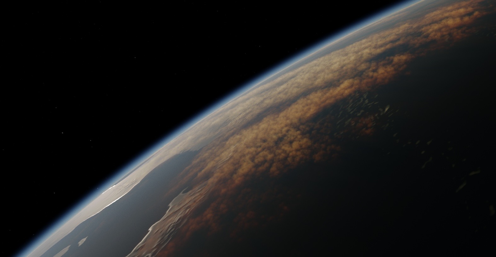
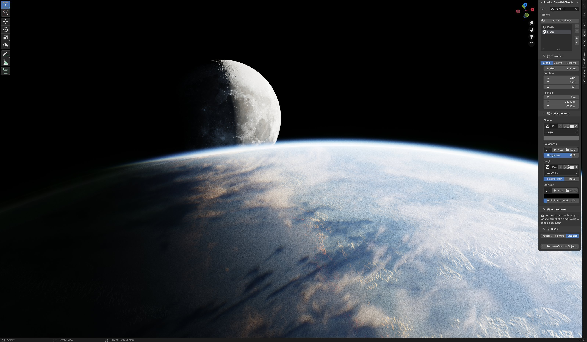

### 1.1.0 <small>- released 27.11.2024</small>

`new:`{: .label-new }

- The addon now ships with **built-in presets**.
- Introduced a new and improved atmosphere model with various phase functions.
- Added the ability to control the **atmosphere layer height** using a texture.
- Included **background stars** to enhance the planetary experience out-of-the-box.
- Planets now utilize both a physical radius, used for light calculations, and a visual radius, which scales the planet using Blender’s object scale.
- Added a performant Worley noise approximation to enhance detail in atmosphere layer textures.
- Updated planet shaders to use a **HAPKE shader model**, providing realistic retroreflectivity with adjustable parameters.

`improvements:`{: .label-improvements }

- Improved viewport **performance of rotating** and adjusting **sun** lighting.
- Atmosphere parameters are now provided with physical values.
- Preset system has been improved and now supports textures.

`fixed:`{: .label-fixed }

- Several rendering improvements and fixes to make shadows, atmosphere, planet sorting consistent and realistic.

### 1.0.0 <small>- released 04.09.2024</small>

`new:`{: .label-new }

Reworked atmosphere model:

- Upgraded atmosphere calculations to more accurate and flexible ones.
- Added a layer system with 6 fully customizable layer slots that can influence the scattering, absorption, and emission of the atmosphere.
- Added ability to use density textures on atmosphere, on a per-layer basis, enabling effects such as clouds and auroras.
- Added procedural aurora density texture option to layers.

`improvements:`{: .label-improvements }

- UI improvements to make it more in-line with our other addons.
- Improvements to depth calculations in all parts of the planet shader tree.
- Improved shadows, reducing cases where they didn't show up involving rings.

`fixed:`{: .label-fixed }

- Fixed multiple sorting issues, especially involving atmosphere and rings.
- Fixed planet not showing up when added to the scene.
- Fixed edge cases that caused errors when removing/adding planets in certain ways.

### 0.2.0-alpha <small>- released 24.11.2022</small>

<!--  -->

!!! warning ""
    We are still tackling the issue where a planet is not appearing due to uninitialized drivers. We have added the "Reinitialize drivers" button that after a parameter change will reinitialize drivers.

`new:`{: .label-new }

- Ability to add the **rings** to the planet.
- User Interface for the rings.
- Added material texture color space settings directly in the user interface for convenience.
- Rearranged UI blocks in a more intuitive fashion and also to maintain consistency between add-ons.

`improvements:`{: .label-improvements }

- Optimized PSA integration.
- Sun angular diameter now affects all lighting calculations. 
- Completely rewritten the way how nodes are generated.
- Clean up node groups to improve general performance.
- Nodes are now organized in a way to improve readability.

`fixed:`{: .label-fixed }

- Fixed wrong blending of planet depth.
- Fixed cases when some of the drivers were not linked.

!!! info "Having errors when updating add-on?"
    1. Remove previous add-on version
    2. Restart blender
    3. Install new add-on version
